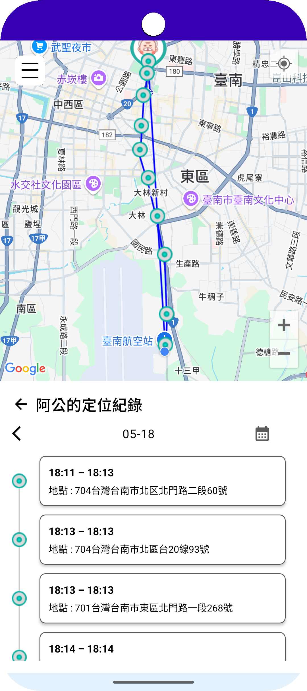

# GeofenceApp 定位分享與地理圍欄通知應用

GeofenceApp 是一款基於 Firebase 架構的 Android 應用，支援即時位置分享、地理圍欄通知、自訂歷史紀錄查詢等功能。使用者可以透過 Email 與好友建立雙向位置共享關係，並對共享對象設定地理圍欄，一旦對方進入或離開特定區域，便能收到推播通知。

---

## 📱 App 預覽

| 註冊頁面                        | 主畫面                        | 側邊選單                        |
|-----------------------------|----------------------------|-----------------------------|
|  |  |  |

| 地理圍欄(Geofence)設定                 | 歷史定位紀錄                       | 帳號設定頁面                               |
|----------------------------------|------------------------------|--------------------------------------|
|  |  |  |

## 功能介紹

### 1. 使用者管理
- 註冊 / 登入功能（Firebase Auth）
- 支援上傳大頭貼與暱稱設定

### 2. 即時位置分享
- 使用者可輸入 Email 邀請他人建立雙向分享關係
- 雙方接受後即可互相觀看對方位置
- 支援背景位置上傳與 FCM 推播通知

### 3. 地理圍欄(Geofence)設定
- 對共享對象設定多組地理圍欄（可選 enter / exit）
- Firebase Firestore 儲存圍欄資訊，Room 儲存本地快取
- Firebase Messaging 傳送通知提醒
- Firebase Cloud Function 背景同步

### 4. 歷史軌跡與停留群聚
- 以日為單位查詢特定日期的停留點與停留時段
- 將定位紀錄以「60 公尺內群聚」合併顯示
- 使用Geocoder將經緯度轉換成地址
- 繪製 Polyline、標記停留區塊與時間

### 5. 通知與權限管理
- 自動註冊 FCM Token 並更新至 Firestore
- 引導使用者手動開啟背景定位

## 技術架構

| 類別        | 使用技術                                           |
|-------------|------------------------------------------------|
| 開發語言    | Kotlin                                         |
| 架構模式    | MVVM + Repository pattern                      |
| Firebase    | Auth、Firestore、Storage、FCM                     |
| 地圖服務    | Google Maps SDK + Geofencing API + Geocoder API |
| 本地儲存    | Room                                           |